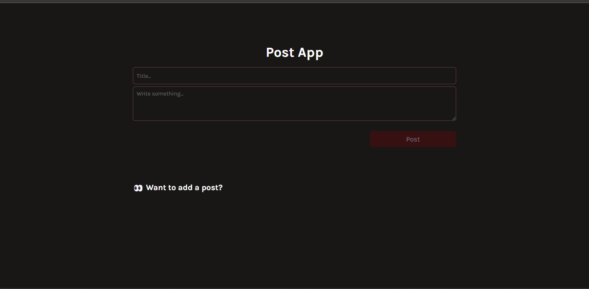
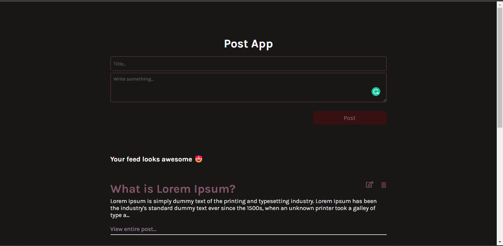
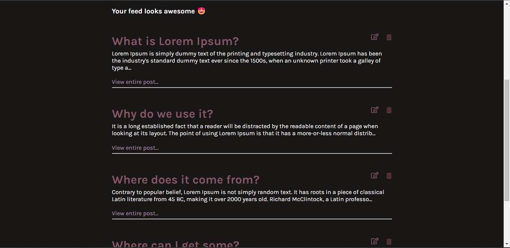
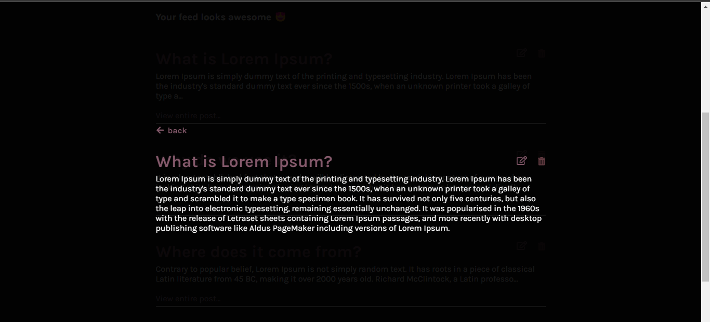

# post-web-app

## Table of contents

- [Overview](#overview)
  - [Project question](#project-question)
  - [Screenshots](#screenshots)
  - [Links](#links)
- [My process](#my-process)
  - [Built with](#built-with)
- [Author](#author)

## Overview

This is an app that allows you to create posts, view one, view all, update and delete posts.

### Screenshots

Home page

Feed

Single Post 

### Links

- Live Site URL: https://post-web-app.netlify.app/

## My process

### Built with

- React + Vite
- SASS
- Mobile first workflow
- Local storage

## Author

- Website - [Maame Yaa Serwaa Bona-Mensa](https://mbonamensa.netlify.app)
- Twitter - [@mys_bm](https://www.twitter.com/mys_bm)